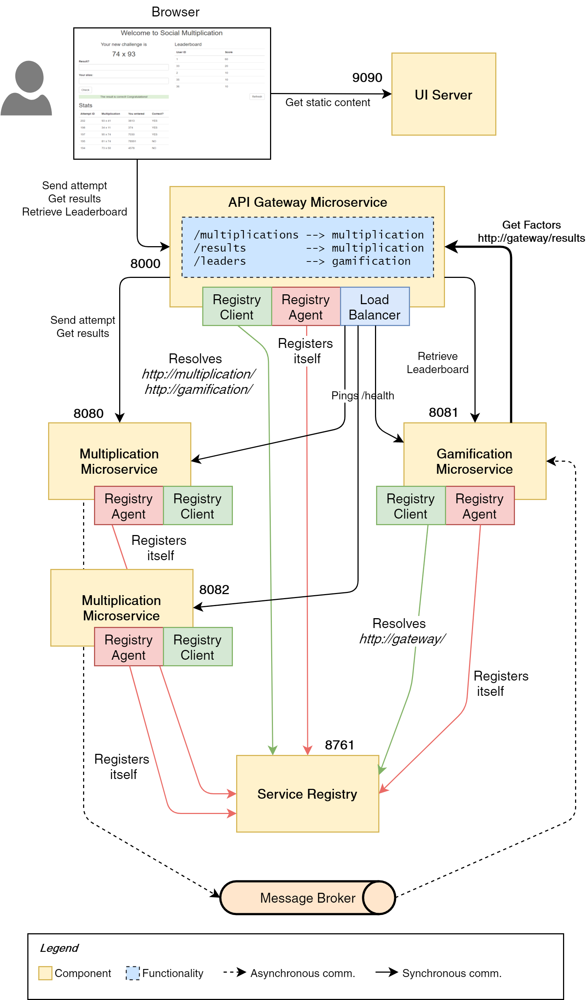

The project shows you how to evolve a simple Spring Boot application to become a full Microservices Architecture, using Spring Cloud Eureka, Ribbon, Zuul and Hystrix to implement Service Discovery, Load Balancing, the API Gateway pattern and a Circuit Breaker. Besides, you'll see how to implement End-to-End tests with Cucumber, an Event-Driven system and the best practices when building Microservices.

## Contents

The repository contains six folders, one for each component of the system:

* **social-multiplication** is one of the backend services. It has a REST API to get and provide results to simple multiplications. When an attempt is sent, it triggers an *event*.
* **gamification** is the second backend service. It provides a REST API to get game stats and reacts to the event sent by the multiplication service, updating the figures.
* **service-registry** is the Eureka Server, which is contacted by backend services and the gateway.
* **gateway** is the Routing Service, implemented with Zuul. It connects with Eureka for service discovery, and performs load balancing with Ribbon.
* **ui** contains the static files of the frontend application. It's configured to be started with Jetty.
* **tests_e2e** contains the end to end test cases, developed with Cucumber (Gherkin notation)

## How to execute the application

These are the instructions:

* **UI**. Download and install [Jetty](http://www.eclipse.org/jetty/download.html). From the command line, execute `java -jar [JETTY_HOME]/jetty-[VERSION]/start.jar` (replace the values between brackets accordingly). You also need Java.
* **RabbitMQ**. Download and install [RabbitMQ](https://www.rabbitmq.com/download.html). We use it as Event bus. When you have installed it, you need to run the RabbitMQ server (as a service or as a process, whatever you prefer).
* **Multiplication, Gamification, Service Registry and Gateway**. You need to start all these services using the command line. Navigate to each folder and execute for every one of them: `./mvnw spring-boot:run`. If you want to try load balancing you can execute more than one instance of the Multiplication or Gamification service. To do that, override the port number to avoid clashing: `./mvnw spring-boot:run -Drun.arguments="--server.port=A_FREE_PORT]"`

